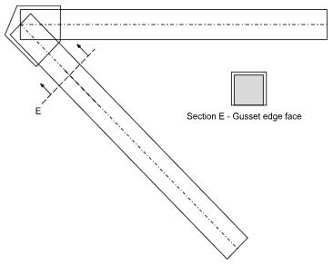

# 3d Printing Support \[DRAFT\]

## Requirement

On command, we'll emit a single OBJ file suitable for slicing and printing. We use OBJ rather than STL so that multiple
snap together pieces can be included. STL supports only one mesh. There appears no reasonable way to make the prints
truly functional. They’ll amount to scale models.

The pieces are:

- **Two trusses**. A pair of mirror image meshes. Pin locations are small square holes. The deck-adjacent side of the
  mesh will be flat so that no support material is needed. Members will have scale sizes. Consequently, the other side
  of the mesh will reflect that variability.
- **Joint pins**. Thin square bars with shouldered ends that snap into joint holes in trusses.
- **Deck segments**. L-shaped prisms. Each includes one deck beam, one segment of deck and wear surface, and pins for
  the deck beam joints. Deck surface segments join with dovetail slots on the bottom surface and "dogbone" snap-in
  double-ended tails. E end segments include the deck cantilever and pillow block for the joint. Deck beams at piers
  also include pillow blocks. Pillow blocks include tabs that mate with slots in abutments.
- **Abutments**. Prisms including the step for the joint pillow with required mating slots to receive pillow tabs. For
  bridges with anchorages, two or four small pillars supporting joint pins are also included.

## Truss manifold algorithm

Slicers only sporadically support objects that aren't proper manifolds. All the pieces listed above are simple to emit
as manifolds except the trusses. Truss triangle sets generated by the BD for 3d rendering are one manifold per member
and one per gusset. The hidden surface removal of OpenGL resolves boundaries between these. We're therefore in need of
an algorithm to render a bridge truss as a manifold.

### Trusses are special

This is a polytope union problem, albeit restricted:

- The members are all axis-oriented rectangular prisms.
- The maximum of 120 members limits arrangement size to about 720.
- The gussets are all convex polygons, each with a single hole, extruded on the z-axis.
- The perimeter facets of gussets are normal to member axes.
- The interior surface of the truss is flat.
- Since the bridge is constructed on a grid, arbitrary degeneracies - nearly parallel lines, nearly coincident points,
  etc. - are unlikely to cause floating point precision issues.
  - Special attention will be needed to the gusset points at member intersections. One option is to merely shift these
    slightly so they don't coincide with the intersections themselves.

Possible ways to proceed:

- Reason about finding the union of 2D polygons rather than general polytopes, then enhance the 2d algorithm with
  special logic to consider the z-axis.
- Exploit the restricted geometry of gussets.

### Polygon union

Algorithms for polygon union either use a sweep line or trace loops. The sweep line processes vertices left-to-right,
accumulating border edges not inside other polygons, The loop tracers traverse cycles in the graph of edges already
augmented with intersection points. They follow edges not obscured by other polygons.

There’s no obvious advantage to either approach in this case. The data structures for sweep line algorithms tend to be
more complex. Loop tracers generally require finding one union vertex on each loop, a substantial subproblem in our case
where the result will have many holes. Line sweep has potential for somewhat better asymptotic complexity, but the
limited size of our problem renders this unimportant.

After some rough experiments, it looks like constructing triangles from a set of 1D loops of vertices with heights will
be complicated. It seems more likely that the sweep line will have the data needed to do this.

### Line sweep

Reference _Plane-Sweep Algorithms for Intersecting Geometric Figures _(Nievergelt). While this doesn’t discuss polygon
union explicitly, the general algorithm and data structures apply. The major adaptation is that the intervals of the “Y
structure” include edges stacks describing multiple overlying polygons. The edges demarking transitions from stacks of
depth 0 to 1 and 1 to 0 are the union edges. The data on the stacks needs to be rich enough to emit triangles.

### Exploit gusset geometry

The idea is to process each gusset interface explicitly.

```
For each member {
  Create an explicit prism with full pin-to-pin length.
}
For each gusset {
  For each incident member {
    Use S-H clipping to trim the member wrt to the gusset.
    For each member-gusset intersection discovered, carve a corresponding chunk out of the gusset.
  }
  Emit triangles for the gusset front and back faces.
}

For each member prism {
  Emit triangles
}
```



How to handle intersecting members?! They can become arbitrarily complicated. We could introduce a pseudo-joint and
gusset for each such set. This isn't perfect. A design with multiple intersections so close the gussets overlap won't be
a manifold. So I think we will implement the sweep line.
