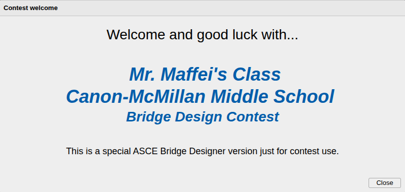
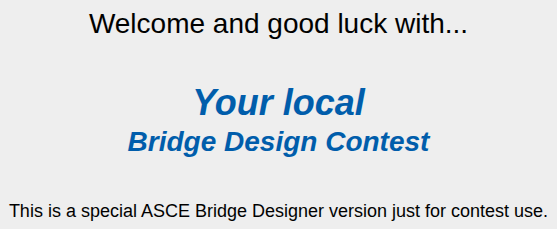
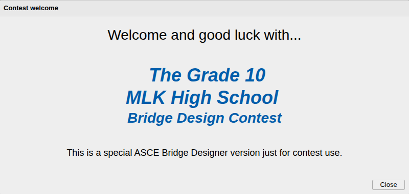
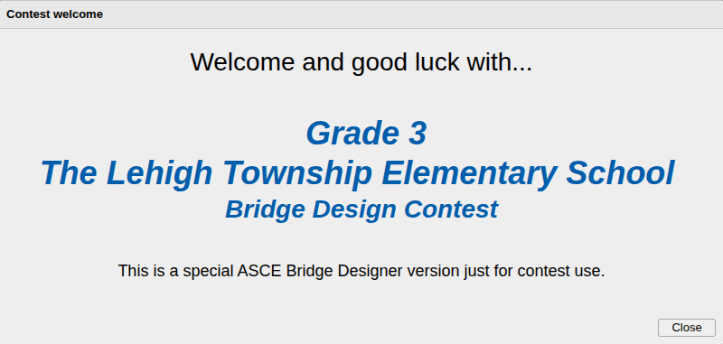

# Contest Support

## Overview

ASCE Bridge Designer includes support for design competitions:

- Legacy 6-digit local contest codes.
- A command line tool that makes it relatively easy to analyze a collection of bridge files, generating a report
  suitable for determining winners.
- A way to customize the Bridge Designer to prevent "cheating" in contests run periodically (for example, once a year or
  semester). A previous contest-winning bridge won't load in a new contest's customized Bridge Designer. Even if redrawn
  manually, the bridge is unlikely to win again.

## Future support?

In a perfect world, there would be a back end web service for contests. Our team has no resources for this. The command
line tool is a workaround.

As an alternative, we could offer a self-contained server that tech-savvy users could run themselves either locally -
say within a classroom or school network - or - for adventurous souls with the tech resources and knowledge required -
as an internet service.

We want to gauge the level of interest in such a server. If you’d use it, please write
[bridgedesignerteam@gmail.com](mailto:bridgedesignerteam@gmail.com).

We envision something like this. Using a dialog in the Bridge Designer itself, students would connect to the service to
create an anonymous, passworded account for an arbitrarily-named team (no PII collected). They’d be able to upload
designs to the team account with a button press. The server would automatically verify bridges are correct for the
contest and pass the load test, accepting only valid submissions. It would tell them their current contest standing and
periodically update scoreboards accessible via web browser. Contestants could be verified as members of a winning team
by watching them log in to the winning account.

If we do this project, early adopters and testers will have direct input on server details.

## Legacy 6-character codes

This has long been a quick way to set up a contest where only one of the almost 400 design condition options is
available. It is appropriate for contests lasting for hours up to a few days, since finding the optimum among 400 options 
requires much effort (or excellent luck).

See instructions in the
[Bridge Designer's help](https://gene-ressler.github.io/bridge-designer/app/?help=hlp_local_contest). Search for "local
contest".

Use manual methods or the CLI tool below to compile contest results.

## Command line interface (CLI) tool

This tool assumes that a contest administrator collects bridge files from contestants and places them all in a single
directory. A shared folder service like Google Drive or Dropbox is helpful for this. Once the CLI program is installed, 
the administrator need only type a single command, for example:

```
bdc analyze --cost --conditions *.bdc > report.csv
```

This analyzes all the files with a `.bdc` extension and creates a report in CSV format in file `report.csv`, easily
imported into a spreadsheet.

### Installation

There's a pre-compiled binary at `/dist/main.cjs`. Copy it to a directory that your `bash`-style shell can see and `cd`
to that directory. Make it executable with something like `chmod 755 main.cjs` . Now add an alias

```
alias bdc=$(pwd)/main.cjs
```

Put the alias command in `.profile` to make it persistent.

If you don't want to deal with a `bash`-style shell, you can still run the CLI under Windows Command or Powershell after
Node.js is installed with `node main.cjs` replacing `bdc` in all the examples.

### Usage with customized bridge files

If the bridge files being analyzed are produced by a [customized Bridge Designer](#contest-customization) (see below),
 you’ll need to provide the same customization string as used in the URL. That's the string starting with `?p=` provided
by
[this spreadsheet](https://docs.google.com/spreadsheets/d/1YkOOZiGRG0oO5PKL2DB8yqdXIiRB24nUdmIWBAa1A2Y/edit?gid=0#gid=0).

```
bdc --contest-params 'CUSTOMIZATION' analyze ...
```

Alternately, the customization can be saved in a file. Let's say it's called `contest-params.json`. Then the command is

```
bdc --contest-params-file contest-params.json analyze ...
```

The file content must be valid JSON, not the URI-encoded parameter string. It's available in the spreadsheet under the
heading **Contest params.**

### Report format

The following formats are supported with the option `--format NAME` .

<table>
  <tr>
   <td><strong>Format</strong>
   </td>
   <td><strong>Name</strong>
   </td>
   <td><strong>Notes</strong>
   </td>
  </tr>
  <tr>
   <td>CSV
   </td>
   <td><code>csv</code> 
   </td>
   <td>Default if no format given
   </td>
  </tr>
  <tr>
   <td>JSON
   </td>
   <td><code>json</code> 
   </td>
   <td>
   </td>
  </tr>
  <tr>
   <td>Tab-delimited text
   </td>
   <td><code>tabs</code> 
   </td>
   <td>Included tabs escaped: <code>\t</code> 
   </td>
  </tr>
  <tr>
   <td>Raw
   </td>
   <td><code>raw</code> 
   </td>
   <td>Described below
   </td>
  </tr>
</table>

The raw format is intended for easy parsing by other programs that read a line at a time. In the description below,
newlines and lower case words are literal, `[]` means optional based on command line, `{}` means repeated.

```
bridge
FILE_NAME
STATUS
[CONDITIONS_TAG
CONDITIONS_CODE]
[COST]
[MEMBER_COUNT
member
{MEMBER_NUMBER
 TENSION_STRENGTH
 MAX_TENSION
 TENSION_STATUS
 COMPRESSION_STRENGTH
 MAX_COMPRESSION
 COMPRESSION_STATUS}]
```

Here's an example where all options are selected,

```text
bridge
MyBridge.bdc
pass
64A
1082012051
457347.29
30
member
1
9500
403.3591831102967
ok
6990.9851102714565
0
ok
member
... remainder of 29 members elided
```

### Report content

The report includes the following information in any of four different formats (csv, tab-delimited text, JSON, or a
"raw” format meant to be easily parsed by other tools):

<table>
  <tr>
   <td><strong>Data</strong>
   </td>
   <td><strong>When reported</strong>
   </td>
   <td><strong>Notes</strong>
   </td>
  </tr>
  <tr>
   <td>File name
   </td>
   <td>Always
   </td>
   <td>From the command line. Ex: <code>MyBridge.bdc</code>
   </td>
  </tr>
  <tr>
   <td>Analysis result
   </td>
   <td>Always
   </td>
   <td><code>pass</code>, <code>fail-load</code>, <code>fail-slenderness</code>, <code>invalid</code> 
   </td>
  </tr>
  <tr>
   <td>Design conditions
   </td>
   <td>Option <code>--conditions</code> or <code>-d</code>
   </td>
   <td>Code and tag. Ex: <code>1091204100 28A</code>
   </td>
  </tr>
  <tr>
   <td>Total bridge cost 
   </td>
   <td>Option <code>--cost</code> or <code>-c</code>
   </td>
   <td>Dollars as 2-place decimal. Ex: <code>276485.30</code>
   </td>
  </tr>
  <tr>
   <td>Member details
   </td>
   <td>Option <code>--members</code> or <code>-m</code>
   </td>
   <td>Available only in <code>json</code> and <code>raw</code> formats.
    <br>
    Per-member information:
    <br>
     Number
    <br>
     Tension strength
    <br>
     Max tension
    <br>
     Tension status
    <br>
     Compression strength
    <br>
     Max compression
    <br>
     Compression status
   </td>
  </tr>
</table>

## Contest customization

This feature provides a way to customize the Bridge Designer for a specific contest by appending a special string to the
end of the normal URL.

The goals of customization are:

- **Inform the contestant.** Give a signal that they are using the Bridge Designer meant for their contest.
- **Make contest results unique.** Make it difficult to successfully use the same design to compete well in two
  different contests.
- **Prevent confusion.** Don’t allow bridge files saved from a customized Bridge Designer to be loaded into the
  uncustomized one or one customized in a different way.

For example, if the normal Bridge Designer URL is

<code>[https://app.asce.org/bridge-designer/app/](https://app.asce.org/bridge-designer/app/)</code>

then a customized URL might be...

<code>[https://app.asce.org/bridge-designer/app/?p=%7B%22c%22%3A100%2C%22k%22%3A%22g92%22%2C%22n%22%3A%22Mr.%20Maffei%27s%20Class%5CnCanon-McMillan%20Middle%20School%22%7D](https://app.asce.org/bridge-designer/app/?p=%7B%22c%22%3A100%2C%22k%22%3A%22g92%22%2C%22n%22%3A%22Mr.%20Maffei%27s%20Class%5CnCanon-McMillan%20Middle%20School%22%7D)
</code>

With this, Bridge Designer works a bit differently:

- When it starts, a special "splash dialog” appears for a few seconds:

  

- When costs are calculated, each joint connection adds $100 rather than the default, $400.
- When bridge files are saved, they’re "scrambled” using the key `g92`. No file can be loaded into the customized Bridge
  Designer unless it was scrambled with the same `g92` key. (If you try, the bridge designer will just show an error
  message.)

There are many customization options.

### Preparing a customization

The contest administrator prepares the contest URL and then publishes it in instructions to all contestants. For
publishing, any medium with clickable links is fine: email, social media, shared document (for example Google Doc) or
web page. Using printed paper or other non-clickable media won't work well. The customization string is too complicated
for manual copying. **It’s important that every contestant realizes the special URL must be used**. The normal Bridge
Designer URL with no customization won’t produce a valid contest entry.

How to determine the extra URL string? The key tool is
[this spreadsheet](https://docs.google.com/spreadsheets/d/1YkOOZiGRG0oO5PKL2DB8yqdXIiRB24nUdmIWBAa1A2Y/edit?gid=0#gid=0).
The column titled **Contest** provides over 20 boxes. Each is a customizable feature. Letting a box empty means it is
_not_ customized.

After filling in all desired boxes, the extra URL string is in the bottom row of the sheet. Copy the leftmost cell and
paste it at the end of the Bridge Designer URL in your contest instructions.

**_You’ll want to be sure to test the URL before publishing to ensure it works as intended! Publishing a bad URL would
be very confusing for contestants._**

### The boxes

Contest box values in the spreadsheet control various behaviors of Bridge Designer:

- Contest information presented to users.
- The format of bridge files.
- The weight of the truck load, which determines if a bridge passes the load test or not.
- How much bridge features cost, affecting the total cost.

Changing bridge designer cost, material, and load parameters can be tricky. A known-good method is to start with last
year’s parameters (or defaults if last year didn’t use any) and best bridges. Adjust box values until those bridges can
be easily beaten. Structural design knowledge is useful.

#### Don’t be intimidated

Of the 20+ boxes available, you’ll need only a few, typically 4 or 5, to define a great contest. We’ll explain how
later.

A complete list of options follows.

#### User information

- **Splash dialog.** _Any_ customization string, even one that changes nothing (that’s `?p=%7B%7D`) causes the contest
  "splash dialog” to appear, welcoming the user to a contest whenever Bridge Designer is started. It disappears after a
  few seconds, or the user can dismiss it with a button.
- **contestName** - The contest name presented on the splash dialog. With no name given, the default is:

  

  If you enter a contest name, it replaces "Your local” in the dialog. Contest names with multiple lines can be
  displayed using `\n` (backslash then lower case n) to denote a break between lines. For example, setting this value to
  `The Grade 10\nMLK High School `produces

  

  _Pro tip:_ Even if you don’t set any other boxes, adding a contest name creates some excitement for young students.\
  _Pro tip:_ Contest names usually read best with a leading "The" as here or trailing possessive " 's " as in "_Chapel
  Hill Middle School's ..."_.

#### Contest-related values

- **bridgeVersion** - _Not often needed._ A 4-digit positive integer with no leading zeros (e.g. 1234) used to reject
  bridge files not created by the customized Bridge Designer. Traditionally, it’s the contest year. But any value is
  fine.
- **designConditionsCode** - _Not for general use._ This is for specifying design conditions not normally available at
  all in the setup wizard. Traditionally, it’s used to create fresh challenges for top-level competition rounds. Write
  [bridgedesignerteam@gmail.com](mailto:bridgedesignerteam@gmail.com) for details.
- **designConditionsTag** - _For restricting the contest to a single set of design conditions._ A 3-character code
  determined by setting up the bridge designer with the design conditions you desire. Look at the Project ID in the
  title block at the lower right of the drawing. It will look something like this:

  > Project ID: 00064A ‑ Your Project ID!

  The code is the last three characters of the initial alphanumeric string. In this case, that’s **64A**. The code will
  always be two digits and a letter A through D.  \
  _Pro tip 1:_ Restricting design conditions simplifies the bridge design problem by reducing the work needed to find an
  optimal design. \
  _Pro tip 2:_ Conditions with low decks - closer to the river - often allow fewer efficient design options, and they’re
  quicker to draw. They’re useful for very young students and/or short contests: small numbers of hours.

- **encryptionKey** - _Good practice to use, but not required_. Any string of characters used to "scramble” bridge file
  contents to make them unreadable and unique for your contest. If no key is given, the contents of the file are not
  scrambled.

#### Load values

_These values are good for changing bridge test pass/fail behavior._ Note that if you specified **designConditionsTag**,
only one of the two is relevant, determined by the truck load of the conditions you chose. If you _didn’t_ specify a
tag, then when one of these is set to a non-default value, strongly consider changing the other as well.

- **heavyAxleLoads** - The weight in kilonewtons of the heavy truck traveling in a single lane. A pair such as
  `[137,137]` that gives the front and rear axle loads in that order.
- **standardAxleLoads** - The weight in kilonewtons of standard trucks traveling in both left and right lanes. A pair
  such as `[71,181]` that gives the front and rear axle loads in that order.

_Pro tip:_ Don’t change these more than about 20% with respect to defaults. Big changes are likely to result in
unrealistic behavior of the Bridge Designer. Don’t forget to TEST, TEST, TEST. \
_Pro tip:_ While handy for contests, changing these is not realistic for real US highway engineering. The Bridge
Designer Help explains that the default values are AASHTO standards.

#### Cost values

Some of these will have no effect if **designConditionsTag** is set. For example, only one of
 **deckCostPerPanelHiStrength** and **deckCostPerPanelMedStrength** has any effect. The pier-related costs are relevant
only if the selected conditions have a pier. Similarly for anchorage costs.

- **anchorageCostPer** - Added to the cost for each anchorage joint, which is zero, one, or two. If
  **designConditionsTag** is set, has an effect only if those conditions include anchorages. \
  _Pro tip:_ Decreasing this makes design with anchorages more likely to be optimal and _vice versa_.
- **standardAbutmentBaseCost** - The "base” cost of standard (not arch) abutments. The full cost of each abutment is
  this plus **standardAbutmentCostPerDeckPanel** times the number of deck panels in the span, or in the longest span if
  there is a pier. If **designConditionsTag** is set, has an effect only if those conditions use standard (not arch)
  abutments. \
  _Pro tip:_ Decreasing this makes it more likely a standard abutment will be most economical and _vice versa_.
- **standardAbutmentCostPerDeckPanel** - See **standardAbutmentBaseCost** above.  \
  _Pro tip:_ Decreasing this makes it more likely a long span will be most economical and _vice versa_.
- **archIncrementalCostPerDeckPanel** - See **standardAbutmentCostPerDeckPanel**.  This is the similar for arch
  abutments.
- **connectionFee** - Cost added for each joint. \
  _Pro tip:_ Decreasing this makes designs with larger numbers of joints more competitive and _vice versa_.
- **deckCostPerPanelHiStrength** - Cost added for each 4-meter long panel in the bridge deck if it’s made of high
  strength concrete. Number of panels depends on deck height. Lower decks have fewer panels and _vice versa_. If
  **designConditionsTag** is set, has an effect only if those conditions use a high strength deck. \
  _Pro tip:_ Decreasing this makes high-decked bridges of high strength concrete more competitive and _vice versa_.
- **deckCostPerPanelMedStrength** - Same as **deckCostPerPanelHiStrength**, but for decks made of medium strength
  concrete. If **designConditionsTag** is set, has an effect only if those conditions use a medium strength deck. \
  _Pro tip:_ Decreasing this makes high-decked bridges of medium strength concrete more competitive and _vice versa_.
- **productFee** - Cost added for each stock type used in the bridge. A stock type is a unique combination of shape (bar
  or tube), size, and material (kind of steel). \
  _Pro tip:_ Decreasing this makes bridges with many different stock types more competitive and _vice versa_.
- **pierCostPerDeckPanel** - Cost added for each deck panel in the longest span supported by a pier. If
  **designConditionsTag** is set, has an effect only if those conditions use a pier. \
  _Pro tip:_ Decreasing this makes high-decks more competitive in bridges that have piers and _vice versa_.
- **pierBaseCost** - The "base” cost of a pier. If **designConditionsTag** is set, has an effect only if those
  conditions use a pier. \
  _Pro tip:_ Decreasing this makes bridges with piers more competitive.
- **lowAlloySteelCostPerKg** - Cost added for each kilogram of low alloy steel used in the bridge. For realism, this
  should be higher than **carbonSteelCostPerKg** because this steel is stronger.
- **carbonSteelCostPerKg** - Cost added for each kilogram of carbon steel used in the bridge. For realism, this should
  be the lowest-cost kind of steel.
- **quenchedAndTemperedSteelCostPerKg** - Cost added for each kilogram of quenched and tempered steel used in the
  bridge. For realism, this should be higher than **lowAlloySteelCostPerKg** because this steel is strongest.
- **excavationCostRate** - Cost added for each cubic meter of soil excavated to prepare the construction site. Bridges
  with decks at ground level require none. Lower bridge spans require "cut” excavation to lower the roadway. The lower
  the deck, the greater the cut, hence the higher the excavation cost. If **designConditionsTag** this isn’t useful
  because all possible designs have the same quantity of excavation.

Side note: You might logically expect to see **archAbutmentBaseCost** included in this list, but it’s not here. That’s
because it’s not a single value but a table based on arch height, too complex to offer as a customization option.

#### An Example

You're running a contest for your 4th grade class. It will last a couple of days. You decide to try the following box
values.

<table>
  <tr>
   <td><strong>contestName</strong>
   </td>
   <td>Grade 3\nThe Lehigh Township Elementary School
   </td>
  </tr>
  <tr>
   <td><strong>encryptionKey</strong>
   </td>
   <td>LehighRocks
   </td>
  </tr>
  <tr>
   <td><strong>designConditionsTag</strong>
   </td>
   <td>64A
   </td>
  </tr>
  <tr>
   <td><strong>connectionFee</strong>
   </td>
   <td>100
   </td>
  </tr>
  <tr>
   <td><strong>pierCostPerDeckPanel</strong>
   </td>
   <td>100
   </td>
  </tr>
</table>

You clear out the Contest column of the
[Parameters Calculator spreadsheet](https://docs.google.com/spreadsheets/d/1YkOOZiGRG0oO5PKL2DB8yqdXIiRB24nUdmIWBAa1A2Y/edit?gid=0#gid=0)
and then enter these four values into the respective boxes. The spreadsheet produces the parameter string

```
?=%7B%22c%22%3A100%2C%22n%22%3A%22Grade%203%5CnThe%20Lehigh%20Township%20Elementary%20School%22%2C%22dt%22%3A%2264A%22%2C%22k%22%3A%22LehighRocks%22%2C%22p%22%3A100%7D
```

It looks hairy, but no matter! You append this to the basic Bridge Designer URL:

```
https://app.asce.org/bridge-designer/app/?p=%7B%22c%22%3A100%2C%22n%22%3A%22Grade%203%5CnThe%20Lehigh%20Township%20Elementary%20School%22%2C%22dt%22%3A%2264A%22%2C%22k%22%3A%22LehighRocks%22%2C%22p%22%3A100%7D
```

It’s time to test it! You click the link. The Bridge Designer starts with a splash!



You check that the parameters are working as intended by opening the browser’s console in the Bridge Designer tab. For
the parameters above, you should see this:

```text
effective contest parameters {
  "version": 1,
  "isPatched": true,
  "anchorageCostPer": 6000,
  "archIncrementalCostPerDeckPanel": 3300,
  "bridgeVersion": 2024,
  "carbonSteelCostPerKg": [
    4.3,
    6.3
  ],
  "connectionFee": 100,
  "contestName": "Grade 3\nThe Lehigh Township Elementary School",
  "deckCostPerPanelHiStrength": 5100,
  "deckCostPerPanelMedStrength": 4700,
  "designConditionsCode": 0,
  "designConditionsTag": "64A",
  "encryptionKey": "LehighRocks",
  "excavationCostRate": 1,
  "heavyAxleLoads": [
    137,
    137
  ],
  "lowAlloySteelCostPerKg": [
    5.6,
    7
  ],
  "pierBaseCost": 0,
  "pierCostPerDeckPanel": 100,
  "productFee": 1000,
  "quenchedAndTemperedSteelCostPerKg": [
    6,
    7.7
  ],
  "standardAbutmentBaseCost": 6000,
  "standardAbutmentCostPerDeckPanel": 500,
  "standardAxleLoads": [
    71,
    181
  ]
}
```

How to open the console is browser dependent. In Chrome and other Chromium-based browsers, select the kebab menu
(&nbsp;**⠇**), then **More Tools**, and finally **Developer Tools**. Click the **Console** tab if not already clicked.

All is working okay, but during testing you realize that a single scenario design makes changing the pier cost per deck
panel kind of lame. The student doesn’t have any choice involving the pier, and other effects are minimal.

No worries, you set that box back to empty. Now the customization is

```
?p=%7B%22c%22%3A100%2C%22n%22%3A%22Grade%203%5CnThe%20Lehigh%20Township%20Elementary%20School%22%2C%22dt%22%3A%2264A%22%2C%22k%22%3A%22LehighRocks%22%7D
```

You test again and all looks fine. You publish the full URL with contest instructions. All in all, it takes about 10
minutes.

After the contest ends, you collect bridge files by downloading the Google Drive folder where the students put them. You
unzip them in a folder on your computer and run the command line tool in a `bash`-style shell to create a report:

```
bdc --contest-params '?p=%7B%22c%22%3A100%2C%22n%22%3A%22Grade%203%5CnThe%20Lehigh%20Township%20Elementary%20School%22%2C%22dt%22%3A%2264A%22%2C%22k%22%3A%22LehighRocks%22%7D' analyze --cost *.bdc > scores.csv
```

Note the single quotes around the parameter string! This tells bash to accept the string as-is.

You import `scores.txt` to a Google sheet, and sort the resulting table by cost to determine how the submissions ranked.

## Tool implementation notes

This section is developer information. Normal users can ignore it.

The tool is a Node JS program developed with version 24.x. It should run fine on any platform where Node does. However,
it's been tested only with Linux.

The CLI accepts lists of paths, expecting the shell to expand globs. A typical use case would be

```
bdc analyze *.bdc
```

to analyze all bridge files in a directory. This will work only with `bash`-style glob expansion by the shell. Windows
Command doesn't do such expansion, and Powershell requires extra code. We recommend checking out options like WSL, Git
Bash, Cygwin, or Nushell that provide `bash`-style behavior within Windows.

### Tool chain

A non-Angular tool chain is required to support Angular services running in a Node CLI. All below was inferred by
searching documentation as far as possible, then turning to possibly untrustworthy user reports and offered "solutions"
to similar problems. It certainly may contain errors. The solutions adopted work, but may not be the best possible.

#### Dependency injection

The main problem was dependency injection. Modern Angular static injection depends on the Angular Typescript compiler's
decoration processing, which isn't supported in Node. We could have used `new` to build a service hierarchy manually,
but this would have been fragile.

Package [`injection-js`](https://github.com/mgechev/injection-js) is an extraction of the old Angular reflective
injection sub-system updated to support `inject()` and other constructs added since reflective injection was dropped.
The author/maintainer is at Google. The package honors `Injectable()` notations and mostly "just works" after an
injector including the required service graph is constructed. The normal Angular `useValue` provider feature allows
replacing dependencies not needed at runtime (e.g. session save/restore) with minimal dummy objects, pruning the service
graph.

#### Effect CLI

We decided to use [Effect CLI](https://www.npmjs.com/package/@effect/cli) to provide command line parsing and handling
support. It's very nice, but has a significant learning curve to gain familiarity with the `Effect` API, a medium-thick
abstraction layer over promises with minimal examples and often-thin documentation. Gemini is pretty good at filling the
gaps.

#### Clashes

Unfortunately, Typescript compilation options of the DI and CLI packages clash: CJS vs MJS. The `tsx` and/or `ts-node`
methods of on-the-fly compile-and-go Typescript execution preferred by `Effect` apparently do not work with the
reflection "shim" needed by DI. Finally, all existing BD code uses Typescript-style imports with no filename suffixes,
while Node expects `.js`.

The simplest way to work around all of this appeared to be a Node-compatible bundler. Since `esbuild` is already native
to Angular, we used it here. The last sticking point was that neither `esbuild` nor Node handle decorations
(`@Injectable()`) natively. This is fixed up with an `esbuild` plug-in that runs source through the Typescript compiler.
The package author laments that this slows down `esbuild`, but our little CLI still compiles in a second or so. It's a
bit scary that even using `esbuild --minify`, the output is megabytes. Most is angular machinery.
